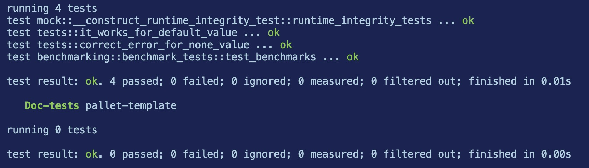
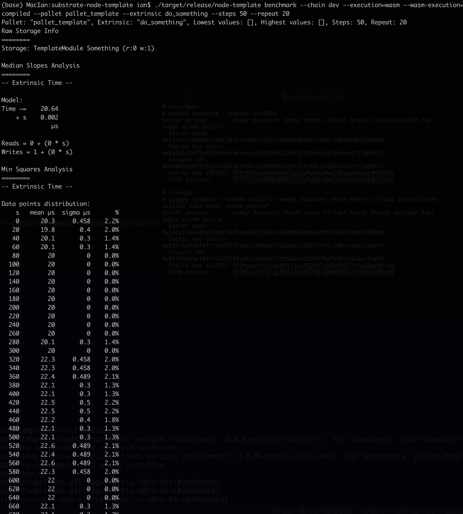
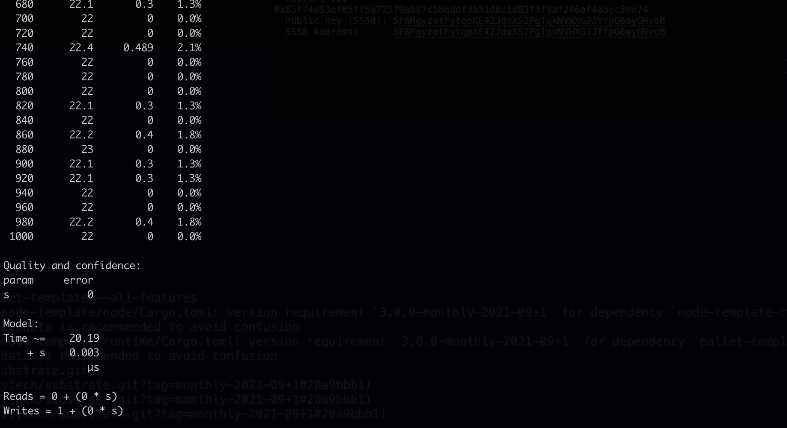

# Exercise 6

## Benchmarking & Weights

### Build

```sh
cargo build --release --features runtime-benchmarks
```

### Test

```sh
cargo test -p pallet-template --all-features
```

The results will be:


### Run

```sh
./target/release/node-template benchmark --chain dev --execution=wasm --wasm-execution=compiled --pallet pallet_template --extrinsic do_something --steps 50 --repeat 20
```

The results will be:


