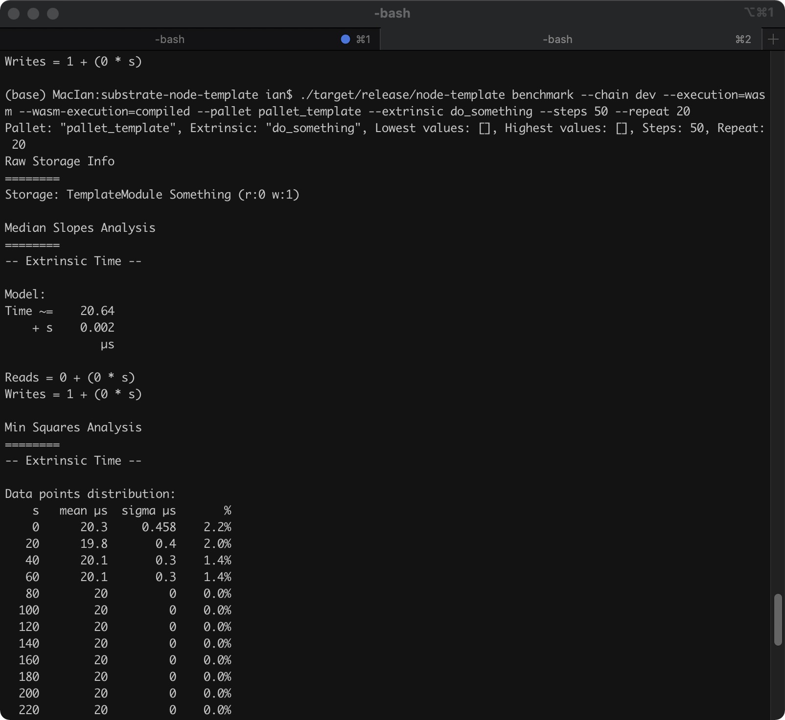

# Exercise 6

## Benchmarking & Weights

### Build

```sh
cargo build --release --features runtime-benchmarks
```

### Test

```sh
cargo test -p pallet-template --all-features
```

The results will be:


### Benchmarking

This step is run to generate the pallet’s Weights trait, for use in the pallet’s #[pallet::weight] tags. It should also be re-run to incorporate changes to the complexities of functions or new dispatchables.

```sh
./target/release/node-template benchmark --chain dev --execution=wasm --wasm-execution=compiled --pallet pallet_template --extrinsic do_something --steps 50 --repeat 20 --output ./pallets/template/src/weights.rs --template ./.maintain/frame-weight-template.hbs
```

It will create or update the source file [weights.rs](./pallets/template/src/weights.rs) in the specific folder. the Weights trait will be:

```rust
#![allow(unused_parens)]
#![allow(unused_imports)]

use frame_support::{traits::Get, weights::{Weight, constants::RocksDbWeight}};
use sp_std::marker::PhantomData;

/// Weight functions needed for pallet_template.
pub trait WeightInfo {
    fn do_something(s: u32, ) -> Weight;
}

/// Weights for pallet_template using the Substrate node and recommended hardware.
pub struct SubstrateWeight<T>(PhantomData<T>);
impl<T: frame_system::Config> WeightInfo for SubstrateWeight<T> {
    fn do_something(s: u32, ) -> Weight {
        (22_320_000 as Weight)
            // Standard Error: 0
            .saturating_add((1_000 as Weight).saturating_mul(s as Weight))
            .saturating_add(T::DbWeight::get().writes(1 as Weight))
    }
}

// For backwards compatibility and tests
impl WeightInfo for () {
    fn do_something(s: u32, ) -> Weight {
        (22_320_000 as Weight)
            // Standard Error: 0
            .saturating_add((1_000 as Weight).saturating_mul(s as Weight))
            .saturating_add(RocksDbWeight::get().writes(1 as Weight))
    }
}
```

Or, just run the command below to review the benchmarking result as below:

```sh
./target/release/node-template benchmark --chain dev --execution=wasm --wasm-execution=compiled --pallet pallet_template --extrinsic do_something --steps 50 --repeat 20
```

The results will be:


